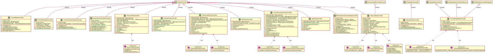

# Waterlove iOS App

## 1.Clone

```
git clone git@github.com:oleksiyPetlyuk/Waterlove.git
cd Waterlove
```

## 2. Dependencies

### Ruby

Ruby `~3.0` is required for this project. 

The preferred way of managing Ruby versions is [rbenv](https://github.com/rbenv/rbenv)

### [Bundler](https://bundler.io)

We use Bundler for managing ruby dependencies.

Install it with:

`gem install bundler`

and install required dependencies by running:

`bundle install`

### [Mint](https://github.com/yonaskolb/Mint)

Mint is used to manage Swift command line tool packages.

Install it with:
```
brew install mint
```

Install required packages specified in `Mintfile`:
```
mint bootstrap
```

### [Swiftlint](https://github.com/realm/SwiftLint)

This project uses Swiftlint for code linting during build phases.

### [R.swift](https://github.com/mac-cain13/R.swift)

This project uses R.swift for autocompleting static resources.

## Distribution

### [Fastlane](https://fastlane.tools)

To automate development and release processes we use Fastlane

Available lanes:
- Lint `bundle exec fastlane lint`
- Test `bundle exec fastlane test`
- Build `bundle exec fastlane create_app`

### CI/CD

[GitHub Actions](https://github.com/features/actions) is used as CI/CD tool.

There is a workflow that creates a new build once a new code is pushed to `master` branch.

## Project overview

### Dependency Management
Swift Package Manager is a preferred way to add dependencies to the project. For libraries that do not support SPM use
CocoaPods instead.
For CLI tools use Mint.

### Targets
There are 2 targets `Waterlove` and `Waterlove Storybook`.
`Waterlove Storybook` is a storybook showcasing application screens and components in different states.

### Navigation and Routing
For routing a concept of [FlowControllers](https://github.com/features/actions) is used.
All flow controllers are located under `$SRCROOT/Waterlove/Library/Flow`

Flow controllers class diagram:


### View Layer
A concept of Data-Driven UI and Unidirectional Data flow is used, all views and view controllers should be configured
using `Props`.
